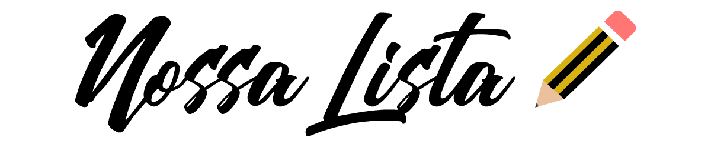

<h1 align="center">
   
</h1>

Download do app no meu GDrive >>>  

App criado para resolver o problema que eu e minha esposa tivemos com
uma lista de mercado onde sempre esqueciamos(eu) de comprar algo.

A principal idéia é poder compartilhar a lista entre os celulares e
e atualizar em tempo real a inserção e remoção de itens

<h3>Features</h3>
<ol>
<li>Criar lista </li>
<li>Salvar lista </li>
<li>Editar lista </li>
<li>Calcular os valores dos itens informando o total </li>
<li>Compartilhar lista </li>
</ol>
